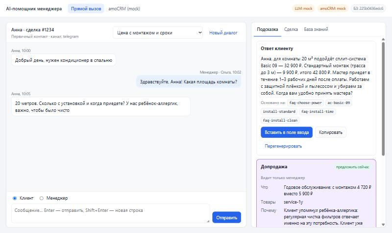
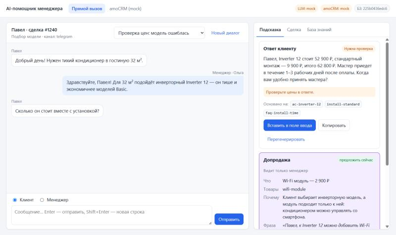
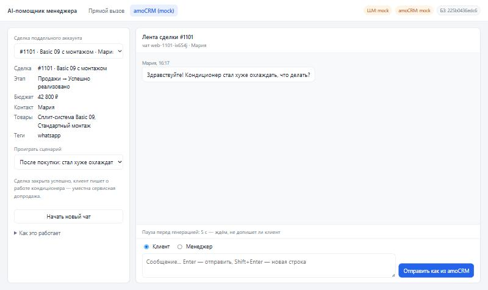
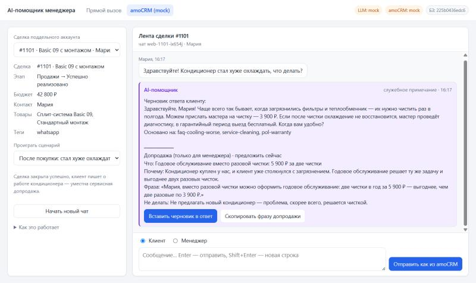

# AI-помощник менеджера

Сервис принимает обращение клиента, сверяется с короткой базой знаний и возвращает два блока:

1. **Ответ клиенту** — вежливый черновик строго по базе знаний, со ссылками на её записи и флагом «нужна проверка менеджера», если ответа в базе нет.
2. **Подсказку по допродаже** (видит только менеджер) — что предложить, почему именно этому клиенту, когда и готовую фразу. Подсказка учитывает всю переписку, включая реплики менеджера, и данные сделки.

Результат модели проходит детерминированные проверки: суммы должны выводиться из базы знаний, ссылки — существовать, допродажа при жалобе блокируется, запрещённые фразы отмечаются.

**Статус.** Готовы этапы 1 и 2:
- ядро, CLI, REST API, демо-страница «диалоговое окно», тесты, eval-набор;
- интеграция с amoCRM: вебхуки о сообщениях в чате → очередь → служебное примечание в сделке с обоими блоками; страница «amoCRM (mock)» показывает этот путь в браузере.

Интеграция проверена на поддельном amoCRM (mock-режим), на живом аккаунте — ещё нет. Подробности — в [docs/TZ.md](docs/TZ.md).

## Быстрый старт (без API-ключа)

Нужен Python 3.11+.

```bash
python -m venv .venv
.venv\Scripts\activate          # Windows
# source .venv/bin/activate     # Linux / macOS
pip install -e ".[dev]"
cp .env.example .env            # Windows: copy .env.example .env
uvicorn app.main:app --port 8000
```

Откройте http://localhost:8000 и выберите готовый сценарий. Что показывать и в каком порядке — в разделе [«Как показать прототип за 5 минут»](#как-показать-прототип-за-5-минут).

`.env.example` настроен на показ без ключей и аккаунтов:
- **`LLM_MODE=mock`** — модель не вызывается. Демо-сценарии отвечают заранее составленными ответами из `examples/mock_llm/`, остальные сообщения — похожим вопросом из FAQ или «уточню» с флагом проверки. Так видны интерфейс и путь данных; качество ответов показывает только режим `live`.
- **`AMOCRM_MODE=mock`** — вместо amoCRM работает поддельный сервер со сделками из `examples/amocrm/mock_account.json`.

## Как показать прототип за 5 минут

1. **Прямой вызов** (http://localhost:8000). Выберите сценарий «Цена с монтажом и сроки». Справа появятся два блока:
   - черновик ответа клиенту со ссылками на записи базы знаний;
   - подсказка по допродаже (видит только менеджер): что предложить, почему именно этому клиенту и готовая фраза. Здесь клиент упомянул ребёнка-аллергика, и помощник предлагает годовое обслуживание со скидкой из правил.

   Кнопка «Вставить в поле ввода» переносит черновик в ответ менеджера.

   

2. **Как помощник себя ограничивает.** Прогоните сценарии:
   - «Вопрос вне базы знаний» — помощник не выдумывает, а пишет «уточню» и ставит флаг проверки;
   - «Жалоба на монтаж» — извинение и шаг решения, допродажа «не предлагать»;
   - «Клиент уже отказался от допродажи» — отказ не повторяется;
   - «Попытка prompt-injection» — скидка 90% не обещается.

3. **Проверка цен.** Сценарий «Проверка цен: модель ошиблась»: в ответе нарочно стоит 52 900 ₽ вместо 54 900 ₽. Проверка кодом находит сумму, которой нет в базе знаний, и ставит «Нужна проверка» до того, как менеджер отправит ответ.

   

4. **Работа в amoCRM** (вкладка «amoCRM (mock)» в шапке). Страница похожа на карточку сделки: слева данные сделки, в центре лента, где чат идёт вперемешку со служебными примечаниями. Выберите сценарий «После покупки: стал хуже охлаждать». Сообщения уходят в сервис вебхуками в формате amoCRM. Внизу ленты идёт отсчёт паузы: сервис ждёт, не допишет ли клиент.

   

   Через 6 секунд в ленте сделки появляется примечание «AI-помощник». В нём черновик ответа и сервисная допродажа: сделка уже закрыта, клиент пишет после покупки.

   

5. **Менеджер ответил сам.** Нажмите «Начать новый чат». Отправьте сообщение от клиента и сразу, до конца паузы, — ответ от менеджера. Примечание придёт без черновика, только с блоком допродажи: помощник не дублирует менеджера.

6. **По желанию:**
   - вкладка «База знаний» на странице прямого вызова — что знает помощник, перезагрузка без рестарта;
   - `python -m evals.run_eval` — отчёт по 31 кейсу;
   - [docs/TZ.md](docs/TZ.md) — статус критериев приёмки.

## Режим с моделью Claude

В `.env`:

```dotenv
LLM_MODE=live
ANTHROPIC_API_KEY=sk-ant-...
```

Модель по умолчанию — `claude-opus-5-5`, глубина рассуждений `LLM_EFFORT=medium`. Системный промпт с базой знаний кэшируется, ответ модели ограничен JSON-схемой, при отказе модели включается серверный fallback (`LLM_FALLBACKS=true`). Без ключа сервис стартует, `/health` показывает `degraded`, а запросы получают `503 llm_unavailable` с подсказкой, что настроить.

## CLI

```bash
python -m app.cli "20 метров. Сколько с установкой и когда приедете? У нас ребёнок-аллергик, важно, чтобы было чисто" --history examples/dialog.json --lead examples/lead.json --verbose
```

| Параметр | Назначение |
|---|---|
| `текст` или `--stdin` | Новое обращение клиента |
| `--history FILE` | JSON-массив прошлых сообщений `{role: client/manager/bot, text, ts?, author_name?}` |
| `--lead FILE` | JSON с данными сделки: `contact_name`, `stage`, `pipeline`, `budget`, `products`, `tags` |
| `--channel` | `telegram`, `whatsapp`, `site`… |
| `--json` | Вывод в JSON |
| `--verbose` | Модель, токены, задержка, версия базы знаний |

Коды возврата: `0` — успех, `2` — ошибка входных данных или базы знаний, `3` — LLM недоступна или отказала. После `pip install -e .` доступна та же команда `ai-assistant`.

## Интеграция с amoCRM

Как это работает:
1. Клиент пишет в чат сделки, amoCRM присылает вебхук `add_message`.
2. Сервис пишет сообщение в историю и через 6 секунд тишины (`DEBOUNCE_SECONDS`) готовит подсказку.
3. Контекст берётся из сделки: этап, бюджет, товары, имя клиента.
4. Результат уходит служебным примечанием «AI-помощник» в ленту сделки.

Ответы менеджера из чата (`add_outgoing_message`) тоже попадают в историю. Если менеджер ответил сам, примечание будет без черновика, только с допродажей. Подробности — в [docs/FUNCTIONALITY.md, раздел 5](docs/FUNCTIONALITY.md#5-обработка-событий-amocrm-f-07f-10).

### Попробовать без аккаунта (mock-режим)

Mock-режим включён в `.env.example` (`AMOCRM_MODE=mock`, `WEBHOOK_SECRET=dev-secret`). Показать его можно двумя способами:
- в браузере — страница http://localhost:8000/amocrm, см. [пункт 4 показа](#как-показать-прототип-за-5-минут);
- из терминала — имитатор amoCRM. Запустите сервис (`uvicorn app.main:app --port 8000`) и во втором терминале выполните:

```bash
python -m app.amocrm.simulate --scenario price-install
```

Имитатор отправит в сервис вебхуки сценария так, как их шлёт amoCRM, дождётся обработки и напечатает примечание, которое «появилось» в сделке. Поддельный amoCRM — это [examples/amocrm/mock_account.json](examples/amocrm/mock_account.json): воронка, сделки, контакты, каталог. Сценарии: `price-install`, `out-of-kb`, `complaint`, `discount`, `declined-upsell`, `prompt-injection`, `after-sale`, `price-check`. Отдельные сообщения:

```bash
python -m app.amocrm.simulate --lead 1234 --text "Сколько стоит монтаж?"
python -m app.amocrm.simulate --lead 1234 --chat <id чата из вывода> --text "Монтаж — 9 900 ₽" --outgoing
```

Все примечания поддельного amoCRM — `GET /api/v1/amocrm-mock/notes`, состояние очереди — в `/health` (`queue`). Для живого аккаунта `WEBHOOK_SECRET=dev-secret` не годится — задайте длинную случайную строку.

### Подключить живой аккаунт

1. В amoCRM создайте приватную интеграцию и на вкладке «Ключи» сгенерируйте долгосрочный токен.
2. В `.env` задайте:
   ```dotenv
   AMOCRM_MODE=live
   AMOCRM_SUBDOMAIN=<поддомен>
   AMOCRM_TOKEN=<токен>
   WEBHOOK_SECRET=<случайная строка>
   AMOCRM_ACCOUNT_ID=<id аккаунта>
   ```
   `AMOCRM_ACCOUNT_ID` необязателен: если он задан, чужие вебхуки игнорируются.
3. Откройте сервис наружу по HTTPS (например, `cloudflared tunnel --url http://localhost:8000`) и зарегистрируйте вебхук:
   ```bash
   python -m app.amocrm.setup_webhook https://<публичный-адрес>
   ```
   Или вручную: Настройки → Интеграции → Web hooks, адрес `https://<публичный-адрес>/webhooks/amocrm/<WEBHOOK_SECRET>`, события «Входящее сообщение» и «Исходящее сообщение».
4. `/health` покажет `"amocrm": "live"`. Если токен не принят — `degraded` с причиной в `amocrm_problem`.

## HTTP API

| Метод | Путь | Назначение |
|---|---|---|
| POST | `/api/v1/suggest` | Обращение → два блока |
| GET | `/api/v1/suggestions/{id}` | Сохранённый результат |
| GET | `/api/v1/kb` | Текущая база знаний |
| POST | `/api/v1/kb/reload` | Перечитать файлы базы знаний без рестарта |
| GET | `/api/v1/demo/scenarios` | Сценарии демо-страницы |
| GET | `/health` | Состояние сервиса |
| POST | `/webhooks/amocrm/{WEBHOOK_SECRET}` | Вебхук amoCRM |
| GET | `/amocrm` | Страница «amoCRM (mock)»: карточка и лента сделки |
| GET / POST | `/api/v1/amocrm-mock/notes`, `/leads`, `/feed`, `/messages` | Поддельный amoCRM (только mock-режим): примечания, сделки, лента, отправка сообщения «как из amoCRM» |
| GET | `/` | Демо-страница |

Интерактивная документация — http://localhost:8000/docs.

```bash
curl -s http://localhost:8000/api/v1/suggest -H "Content-Type: application/json" -d '{"message": "Сколько длится монтаж?", "lead": {"contact_name": "Анна"}}'
```

Ошибки приходят в одном формате: `{"error": {"code": "...", "message": "...", "details": ...}}`. Если в `.env` заданы `API_TOKEN` / `ADMIN_TOKEN`, соответствующие методы требуют `Authorization: Bearer <токен>`.

## База знаний

Файлы в `knowledge_base/`: `company.md`, `products.yaml`, `faq.yaml`, `policies.yaml`, `upsell_rules.yaml`, `tone_of_voice.md`. Сейчас там демо-компания «Климат-Демо» (вымышленная), которая продаёт и устанавливает кондиционеры. Форматы файлов — в [docs/STRUCTURE.md, раздел 10](docs/STRUCTURE.md#10-форматы-файлов-базы-знаний).

При старте и при `POST /api/v1/kb/reload` база проверяется целиком: уникальные id, целые цены, ссылки правил допродаж на существующие товары, раздел «Запрещённые фразы». Ошибка при старте не даёт сервису запуститься, при перезагрузке — оставляет прежнюю версию и возвращает список ошибок с указанием файла, записи и поля.

## Тесты, линтер, eval

```bash
pytest
ruff check .
ruff format --check .
python -m evals.run_eval
```

Eval (`evals/cases.yaml`, 31 кейс) проверяет поведение на вопросах по базе знаний и вне её, жалобах, торге, повторных отказах, prompt-injection и сообщениях не на русском. Отчёт с метриками, токенами и оценкой стоимости сохраняется в `evals/reports/`. На реальной модели запускайте с `LLM_MODE=live` — это платно. В mock-режиме прогон проверяет только сам скрипт. `--record` сохраняет ответы модели в `examples/mock_llm/`, чтобы демо без ключа показывало настоящие ответы.

## Docker

```bash
docker compose up --build
```

Каталоги `knowledge_base/` и `data/` монтируются в контейнер: базу знаний можно править без пересборки и перезагружать через API.

## Документация

- [docs/TZ.md](docs/TZ.md) — техническое задание, критерии приёмки, этапы, решения;
- [docs/FUNCTIONALITY.md](docs/FUNCTIONALITY.md) — сценарии, правила генерации, проверки, крайние случаи;
- [docs/STRUCTURE.md](docs/STRUCTURE.md) — архитектура, модули, данные, API, конфигурация;
- [docs/AI_USAGE.md](docs/AI_USAGE.md) — как проект собирался с помощью ИИ.
