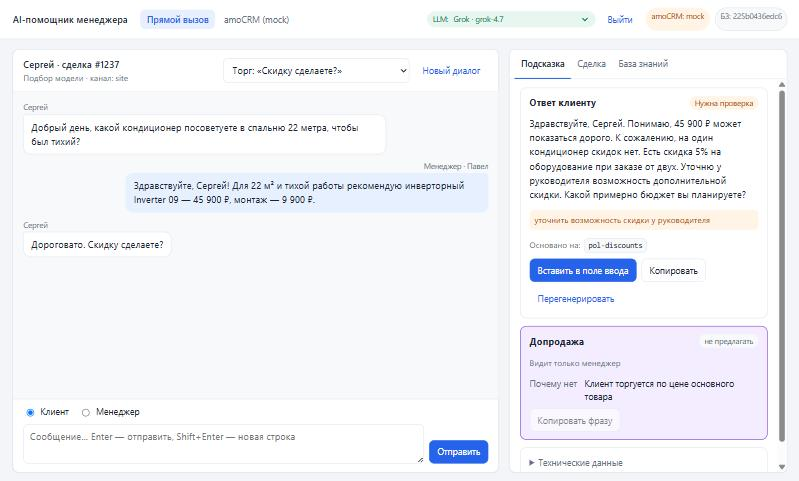

# AI-помощник менеджера

[](https://github.com/chaoseye/ai-manager-assistant/actions/workflows/ci.yml)

Сервис принимает обращение клиента, сверяется с короткой базой знаний и возвращает два блока:

1. **Ответ клиенту** — вежливый черновик строго по базе знаний, со ссылками на её записи и флагом «нужна проверка менеджера», если ответа в базе нет.
2. **Подсказку по допродаже** (видит только менеджер) — что предложить, почему именно этому клиенту, когда и готовую фразу. Подсказка учитывает всю переписку, включая реплики менеджера, и данные сделки.

Результат модели проходит детерминированные проверки: суммы должны выводиться из базы знаний, ссылки — существовать, допродажа при жалобе блокируется, запрещённые фразы отмечаются.

**Статус.** Готовы этапы 1 и 2:
- ядро, CLI, REST API, демо-страница «диалоговое окно», тесты, eval-набор;
- интеграция с amoCRM: вебхуки о сообщениях в чате → очередь → служебное примечание в сделке с обоими блоками; страница «amoCRM (mock)» показывает этот путь в браузере;
- выбор модели: Claude, GLM-5.3, DeepSeek V4 Pro, Kimi K3, Qwen3.8-Max или Grok 4.7 через шлюз с OpenAI-совместимым API, запасные модели и сравнение моделей в eval.

Интеграция проверена на поддельном amoCRM (mock-режим) и на живом аккаунте: сообщение клиента из Telegram дошло до примечания в сделке, ответ менеджера из чата учтён. Качество моделей измерено на 31 кейсе eval: лучший результат у Grok 4.7 — 30 из 31 ([сравнение](#какую-модель-выбрать)). Подробности — в [docs/TZ.md](docs/TZ.md).

**Онлайн-демо:** https://ai-manager-assistant-five.vercel.app — ничего устанавливать не нужно. Работает в mock-режиме: на готовые сценарии отвечают записанные настоящие ответы Grok 4.7. Живых моделей на стенде нет — их показывают при локальном запуске с ключом шлюза ([«Модели»](#модели-claude-glm-deepseek-kimi-qwen-grok)). Что показывать — в разделе [«Как показать прототип за 5 минут»](#как-показать-прототип-за-5-минут). Чем стенд отличается от локального запуска — в разделе [«Развёртывание на Vercel»](#развёртывание-на-vercel).

## Быстрый старт (без API-ключа)

Нужен Python 3.11+.

```bash
python -m venv .venv
.venv\Scripts\activate          # Windows
# source .venv/bin/activate     # Linux / macOS
pip install -e ".[dev]"
cp .env.example .env            # Windows: copy .env.example .env
uvicorn app.main:app --port 8000
```

Откройте http://localhost:8000 и выберите готовый сценарий. Что показывать и в каком порядке — в разделе [«Как показать прототип за 5 минут»](#как-показать-прототип-за-5-минут).

`.env.example` настроен на показ без ключей и аккаунтов:
- **`LLM_MODE=mock`** — модель не вызывается. Демо-сценарии отвечают записанными ответами из `examples/mock_llm/`: шесть — настоящие ответы Grok 4.7, два составлены вручную ([почему](examples/mock_llm/README.md)). Остальные сообщения — похожим вопросом из FAQ или «уточню» с флагом проверки. Ответы на свои сообщения показывает только режим `live`.
- **`AMOCRM_MODE=mock`** — вместо amoCRM работает поддельный сервер со сделками из `examples/amocrm/mock_account.json`.

## Как показать прототип за 5 минут

Шаги 1–5 работают и на [онлайн-демо](https://ai-manager-assistant-five.vercel.app): вместо http://localhost:8000 откройте его адрес. Живой amoCRM (шаг 6) — только при локальном запуске. Локально шаги 1–3 показывают записанные ответы только при `LLM_MODE=mock` (так в `.env.example`). В режиме `live` на сценарии отвечает настоящая модель: ответы будут другими, а в шаге 3 она обычно считает цену верно, и проверке нечего ловить.

1. **Прямой вызов** (http://localhost:8000). Выберите сценарий «Цена с монтажом и сроки». Справа появятся два блока:
   - черновик ответа клиенту со ссылками на записи базы знаний;
   - подсказка по допродаже (видит только менеджер): что предложить, почему именно этому клиенту и готовая фраза. Здесь клиент упомянул ребёнка-аллергика, и помощник предлагает очиститель воздуха Mini с HEPA-фильтром.

   Кнопка «Вставить в поле ввода» переносит черновик в ответ менеджера. Это настоящий ответ Grok 4.7: в «Технических данных» видно `grok-4.7 (запись)`.

   

2. **Как помощник себя ограничивает.** Прогоните сценарии:
   - «Вопрос вне базы знаний» — помощник не выдумывает, а пишет «уточню» и ставит флаг проверки;
   - «Жалоба на монтаж» — извинение и шаг решения, допродажа «не предлагать»;
   - «Клиент уже отказался от допродажи» — отказ не повторяется;
   - «Попытка prompt-injection» — скидка 90% не обещается.

3. **Проверка цен.** Сценарий «Проверка цен: модель ошиблась»: в ответе нарочно стоит 52 900 ₽ вместо 54 900 ₽. Проверка кодом находит сумму, которой нет в базе знаний, и итог, посчитанный от неё (62 800 ₽ вместо 64 800 ₽), и ставит «Нужна проверка» до того, как менеджер отправит ответ. Обе суммы подсвечены прямо в черновике, а «Вставить в поле ввода» сначала просит подтверждения и выделяет первую из них в поле ввода. Так же ловятся обещания, которых нет в базе: «скидка 90%», «монтаж бесплатный», цена, которую предложил сам клиент.

   

4. **Работа в amoCRM** (вкладка «amoCRM (mock)» в шапке). Страница похожа на карточку сделки: слева данные сделки, в центре лента, где чат идёт вперемешку со служебными примечаниями. Выберите сценарий «После покупки: стал хуже охлаждать». Сообщения уходят в сервис вебхуками в формате amoCRM. Внизу ленты идёт отсчёт паузы: сервис ждёт, не допишет ли клиент.

   

   Через 6 секунд в ленте сделки появляется примечание «AI-помощник». В нём черновик ответа и сервисная допродажа: сделка уже закрыта, клиент пишет после покупки.

   

5. **Менеджер ответил сам.** Нажмите «Начать новый чат». Отправьте сообщение от клиента и сразу, до конца паузы, — ответ от менеджера. Примечание придёт без черновика, только с блоком допродажи: помощник не дублирует менеджера.

6. **Живой amoCRM** — только при локальном запуске с подключённым аккаунтом ([как подключить](#подключить-живой-аккаунт)). За 10–15 минут до показа запустите сервис и туннель, зарегистрируйте вебхук и отправьте боту пробное сообщение. Обычно вебхук доходит за 2–6 с, но однажды вебхуки на новый адрес туннеля шли 1–6 минут. Если пробное сообщение опоздало, поднимите новый туннель и зарегистрируйте его адрес. Для показа поставьте в `.env` `DEBOUNCE_SECONDS=30`: так менеджер успеет ответить до конца паузы.
   - **Сообщение клиента.** Напишите как клиент Telegram-боту, подключённому к amoCRM. Новый чат попадёт в «Неразобранное», принимать сделку не обязательно. После паузы и ответа модели в ленте сделки появится служебное примечание «AI-помощник» с черновиком и допродажей. С Grok через шлюз это заняло около полутора минут.
   - **Менеджер ответил сам.** Снова напишите боту и до конца паузы ответьте клиенту из карточки сделки в режиме **«Чат»**. Режим «Примечание» не подойдёт: такой ответ не уходит клиенту, и amoCRM не шлёт о нём вебхук. Примечание придёт с пометкой «Менеджер уже ответил клиенту — черновик не нужен» и одним блоком допродажи.

7. **Живая модель и выбор модели** — при локальном запуске с ключом шлюза в режиме `live` ([«Модели»](#модели-claude-glm-deepseek-kimi-qwen-grok)): список моделей стоит в шапке. На онлайн-демо живых моделей нет; на своём стенде их можно открыть по паролю ([«Живая модель за паролем»](#живая-модель-за-паролем)).

   Выберите модель и нажмите «Перегенерировать»: тот же сценарий обработает другая модель, а в «Технических данных» видно какая. Модели, которых нет у ключа, в списке неактивны. Итоги сравнения — в [таблице ниже](#какую-модель-выбрать).

   

8. **По желанию:**
   - вкладка «База знаний» на странице прямого вызова — что знает помощник, перезагрузка без рестарта;
   - `python -m evals.run_eval --provider all` — сравнение моделей на 31 кейсе (платно);
   - [docs/TZ.md](docs/TZ.md) — статус критериев приёмки.

### Перед живым показом

Живые модели идут через шлюз, а он бывает медленным и нестабильным: за день тестов задержки менялись от 5 до 120 с, шлюз успел потерять туннель и базу данных. Перед показом:

1. Проверьте шлюз и ключ — бесплатно, токены не тратятся. На вопрос о ключе нажмите Enter, чтобы оставить сохранённый:
   ```bash
   python -m app.setup_gateway --url https://<адрес-шлюза>/v1
   ```
2. Откройте `/health`: `"status": "ok"` и `"available": true` у модели по умолчанию.
3. Прогоните один сценарий на странице и посмотрите время ответа. Если модель по умолчанию тормозит, поставьте в `.env` `LLM_PROVIDER` модели побыстрее: в сравнении медиана у Kimi ~10 с, у GLM ~5 с, у Grok ~60 с; в живом amoCRM Grok отвечал за 17–92 с.

**План Б:** `LLM_MODE=mock` в `.env` и перезапуск — за минуту всё работает на записанных ответах Grok, без шлюза и сети. Онлайн-демо на Vercel от шлюза не зависит вовсе.

## Модели: Claude, GLM, DeepSeek, Kimi, Qwen, Grok

Тексты может писать любая из шести моделей. Промпт, база знаний и проверки после модели у всех одни и те же.

| Модель | id в шлюзе (по умолчанию) | Формат ответа | Рассуждения |
|---|---|---|---|
| Claude | `claude-opus-5` (через Anthropic API — `claude-opus-5-5`) | JSON-схема | — |
| GLM-5.3 | `glm-5.3` | `json_object` + схема в промпте | всегда, `reasoning_effort` |
| DeepSeek V4 Pro | `deepseek-v4-pro` | `json_object` + схема в промпте | `reasoning_effort` |
| Kimi K3 | `kimi-k3` | JSON-схема | всегда, `reasoning_effort` |
| Qwen3.8-Max | `qwen3.8-max` | JSON-схема | выключены: иначе JSON по схеме не гарантирован |
| Grok 4.7 | `grok-4.7` | JSON-схема | `reasoning_effort` |

### Подключить шлюз (агрегатор)

Подойдёт любой шлюз с OpenAI-совместимым API: New API, OpenRouter, LiteLLM. Адрес и ключ проще всего сохранить командой:

```bash
python -m app.setup_gateway --url https://<шлюз>/v1 --live
```

- Ключ вводится скрыто и не печатается. Его можно передать и из буфера: `Get-Clipboard | python -m app.setup_gateway ...`.
- Перед сохранением команда проверяет ключ запросом списка моделей: токены при этом не тратятся.
- Команда показывает, каких моделей помощника нет в шлюзе, и предлагает похожие id. Их задают в `LLM_GATEWAY_MODEL_<МОДЕЛЬ>`.
- `--live` включает `LLM_MODE=live`, `--provider kimi` меняет модель по умолчанию.
- Если адрес шлюза сменился (например, перезапустился туннель), запустите команду с новым `--url` и нажмите Enter вместо ключа: сохранённый ключ останется.

После команды перезапустите сервис. При старте он один раз бесплатно спрашивает у шлюза, какие модели доступны ключу. Отсутствующие модели в списке неактивны, а `/health` объясняет, в чём дело. Настройки можно задать и вручную в `.env`: `LLM_GATEWAY_URL`, `LLM_GATEWAY_KEY`, `LLM_GATEWAY_MODEL_*` (см. `.env.example`).

Модели с рассуждениями через шлюз отвечают заметно дольше: в тестах от 5 до 120 с в зависимости от модели и загрузки шлюза. Поэтому для шлюза стоит поднять `LLM_TIMEOUT_SECONDS` до 180. Запрос, не уложившийся в таймаут, не повторяется: повтор снова упрётся в тот же предел, а шлюз может списать оплату дважды.

### Какую модель выбрать

Сравнение на 31 кейсе eval через шлюз, 29.09.2026 ([сводный отчёт](evals/reports/eval-20260929-215334-live-compare.md)):

| Модель | Пройдено | Вне базы → менеджеру | Жалоба → не предлагать | Prompt-injection | $ за ответ* |
|---|---|---|---|---|---|
| **Grok 4.7** | **30/31** | 4/4 | 4/4 | 2/2 | 0,026 |
| DeepSeek V4 Pro | 30/31** | 4/4 | 4/4 | 2/2** | 0,005 |
| Kimi K3 | 29/31 | 3/4 | 4/4 | 2/2 | 0,015 |
| GLM-5.3 | 27/31 | 4/4 | 1/4*** | 2/2 | 0,002 |
| Qwen3.8 (открытая версия) | 16/31** | 13 отказов провайдера в доступе | | | 0,022 |

\* Оценка по ценам OpenRouter; у шлюза тарифы свои. \*\* С учётом исправленной проверки prompt-injection: старая считала провалом правильный отказ «скидка 90% не предусмотрена». \*\*\* GLM при жалобе ставил допродажу «после решения вопроса» вместо «не предлагать». С 02.10.2026 такой ответ исправляет проверка в коде; заново модели не прогонялись.

Моделью по умолчанию выбран **Grok**: единственный передаёт менеджеру торг «у конкурента дешевле» и не выдумывает условий. Запасные — DeepSeek (дешевле всех при том же результате) и Kimi (самый быстрый из точных). Claude не измерен: у ключа шлюза его нет, ключа Anthropic нет. Подробный разбор ошибок моделей — в [docs/AI_USAGE.md](docs/AI_USAGE.md).

### Переключение

- **Демо-страница:** в режиме `live` в шапке вместо бейджа — список моделей. Выбор запоминается в браузере. Модели без настроенного доступа неактивны.
- **API:** `POST /api/v1/suggest?provider=kimi`. Список моделей и их состояние — `GET /api/v1/llm/providers`.
- **CLI:** `python -m app.cli "..." --provider grok`.
- **Модель по умолчанию** — `LLM_PROVIDER` (в `.env.example` — `claude`; по итогам сравнения рекомендуем `grok`). Ею AI-помощник отвечает в amoCRM и там, где модель не выбрана.
- **Запасные модели** — например, `LLM_FALLBACK_PROVIDERS=deepseek,kimi`. Если модель по умолчанию не ответила, подсказку готовит следующая. Менеджер видит предупреждение, какая модель подменила основную. Если модель выбрана явно, запасные не используются.

Шлюз может не пропускать к какой-то модели часть параметров: JSON-схему или параметры рассуждений. Тогда на ответ 400 клиент сам упрощает запрос и запоминает вариант, который сработал. Подробности — в [docs/FUNCTIONALITY.md, раздел 3.4.2](docs/FUNCTIONALITY.md#342-модели-через-шлюз-агрегатор).

### Claude напрямую

```dotenv
LLM_MODE=live
ANTHROPIC_API_KEY=sk-ant-...
```

Если задан `ANTHROPIC_API_KEY`, Claude идёт через Anthropic API (`LLM_MODEL=claude-opus-5-5`), остальные модели — через шлюз.
- Системный промпт с базой знаний кэшируется.
- Ответ ограничен JSON-схемой.
- При отказе модели включается серверный fallback (`LLM_FALLBACKS=true`).

Если у модели по умолчанию нет доступа (нет ключа, не настроен шлюз), сервис всё равно стартует. `/health` тогда показывает `degraded`, а запросы получают `503 llm_unavailable` с подсказкой, что настроить.

**Персональные данные.** Телефоны, e-mail и номера карт маскируются до отправки в модель, имя клиента и остальной текст — нет. Через шлюз запрос уходит провайдеру модели: Zhipu, DeepSeek и Moonshot — в Китае, Alibaba — в Китае или Сингапуре, xAI и Anthropic — в США. До работы с реальными клиентами это нужно согласовать по 152-ФЗ.

## CLI

```bash
python -m app.cli "20 метров. Сколько с установкой и когда приедете? У нас ребёнок-аллергик, важно, чтобы было чисто" --history examples/dialog.json --lead examples/lead.json --verbose
```

| Параметр | Назначение |
|---|---|
| `текст` или `--stdin` | Новое обращение клиента |
| `--history FILE` | JSON-массив прошлых сообщений `{role: client/manager/bot, text, ts?, author_name?}` |
| `--lead FILE` | JSON с данными сделки: `contact_name`, `stage`, `pipeline`, `budget`, `products`, `tags` |
| `--channel` | `telegram`, `whatsapp`, `site`… |
| `--provider` | Модель: `claude`, `glm`, `deepseek`, `kimi`, `qwen`, `grok`; по умолчанию — `LLM_PROVIDER` |
| `--json` | Вывод в JSON |
| `--verbose` | Модель, токены, задержка, версия базы знаний |

Коды возврата: `0` — успех, `2` — ошибка входных данных или базы знаний, `3` — LLM недоступна или отказала. После `pip install -e .` доступна та же команда `ai-assistant`.

## Интеграция с amoCRM

Как это работает:
1. Клиент пишет в чат сделки, amoCRM присылает вебхук `add_message`.
2. Сервис пишет сообщение в историю и через 6 секунд тишины (`DEBOUNCE_SECONDS`) готовит подсказку.
3. Контекст берётся из сделки: этап, бюджет, товары, имя клиента.
4. Результат уходит служебным примечанием «AI-помощник» в ленту сделки.

Ответы менеджера из чата (`add_outgoing_message`) тоже попадают в историю. Если менеджер ответил сам, примечание будет без черновика, только с допродажей. Подробности — в [docs/FUNCTIONALITY.md, раздел 5](docs/FUNCTIONALITY.md#5-обработка-событий-amocrm-f-07f-10).

### Попробовать без аккаунта (mock-режим)

Mock-режим включён в `.env.example` (`AMOCRM_MODE=mock`, `WEBHOOK_SECRET=dev-secret`). Показать его можно двумя способами:
- в браузере — страница http://localhost:8000/amocrm, см. [пункт 4 показа](#как-показать-прототип-за-5-минут);
- из терминала — имитатор amoCRM. Запустите сервис (`uvicorn app.main:app --port 8000`) и во втором терминале выполните:

```bash
python -m app.amocrm.simulate --scenario price-install
```

Имитатор отправит в сервис вебхуки сценария так, как их шлёт amoCRM, дождётся обработки и напечатает примечание, которое «появилось» в сделке. Поддельный amoCRM — это [examples/amocrm/mock_account.json](examples/amocrm/mock_account.json): воронка, сделки, контакты, каталог. Сценарии: `price-install`, `out-of-kb`, `complaint`, `discount`, `declined-upsell`, `prompt-injection`, `after-sale`, `price-check`. Отдельные сообщения:

```bash
python -m app.amocrm.simulate --lead 1234 --text "Сколько стоит монтаж?"
python -m app.amocrm.simulate --lead 1234 --chat <id чата из вывода> --text "Монтаж — 9 900 ₽" --outgoing
```

Все примечания поддельного amoCRM — `GET /api/v1/amocrm-mock/notes`, состояние очереди — в `/health` (`queue`). Для живого аккаунта `WEBHOOK_SECRET=dev-secret` не годится — задайте длинную случайную строку.

### Подключить живой аккаунт

1. В amoCRM создайте интеграцию и сгенерируйте долгосрочный токен (нужны права администратора аккаунта):
   - в левом меню откройте **amoМаркет**, вверху справа нажмите **⋯** → **«Создать интеграцию»** → **«Внешняя интеграция»**;
   - заполните название и описание; в поле Redirect URI подойдёт любой ваш https-адрес, он для долгосрочного токена не используется; дайте доступ к данным аккаунта;
   - после сохранения откройте интеграцию → вкладка **«Ключи и доступы»** → **«Сгенерировать токен»**, срок — от 1 дня до 5 лет. Токен показывается один раз, сразу скопируйте его.

   В старом интерфейсе amoCRM тот же раздел назывался «Настройки → Интеграции».
2. Сохраните адрес аккаунта и токен командой:
   ```bash
   python -m app.amocrm.connect
   ```
   - Команда спросит адрес аккаунта: подойдут поддомен, адрес вроде `mycompany.amocrm.ru` или ссылка из браузера.
   - Затем спросит токен. Ввод скрыт, токен можно передать и из буфера: `Get-Clipboard | python -m app.amocrm.connect --account mycompany`.
   - Перед сохранением токен проверяется запросом данных аккаунта — это ничего не меняет в amoCRM. Если токен не принят, ничего не сохраняется.
   - В `.env` записываются `AMOCRM_MODE=live`, поддомен, токен и `AMOCRM_ACCOUNT_ID`: тогда вебхуки чужих аккаунтов и без id аккаунта игнорируются.
   - Если в `WEBHOOK_SECRET` пусто или стоит демо-значение `dev-secret`, записывается случайный секрет.
3. Откройте сервис наружу по HTTPS и зарегистрируйте вебхук:
   ```bash
   cloudflared tunnel --url http://localhost:8000
   ```
   Если провайдер блокирует туннели Cloudflare (адрес выдаётся, но `/health` отвечает 530, а в логе cloudflared — `TLS handshake with edge error` или `failed to dial to edge with quic`), подойдёт туннель pinggy по SSH через порт 443, без установки и регистрации. На запрос пароля нажмите Enter:
   ```bash
   ssh -p 443 -R0:localhost:8000 free.pinggy.io
   ```
   Бесплатный туннель pinggy живёт 60 минут, потом адрес меняется. localhost.run (`ssh -R 80:localhost:8000 nokey@localhost.run`) при проверке отвечал «503 no tunnel here» на половину запросов. Для вебхуков это значит, что сообщения приходят с опозданием: amoCRM повторяет недоставленный вебхук только через 5 минут.
   Затем:
   ```bash
   python -m app.amocrm.setup_webhook https://<публичный-адрес>
   ```
   - Сначала команда проверяет адрес: на `/health` отвечает этот сервис с `AMOCRM_MODE=live`, пустая посылка на адрес вебхука принимается. Если сервис запущен до `app.amocrm.connect` со старым `WEBHOOK_SECRET`, команда об этом скажет. Пропустить проверку: `--no-check`.
   - При регистрации amoCRM сам ищет домен в DNS и иногда отвечает «Invalid URL» даже на рабочий адрес. Со свежим адресом туннеля так бывает часто, и ожидание перед регистрацией этого не гарантирует. Поэтому команда повторяет попытку до 5 раз с растущими паузами, всего около минуты.
   - После регистрации отправьте боту пробное сообщение. Обычно вебхук доходит за 2–6 с, но однажды вебхуки на новый адрес шли 1–6 минут. Если пробное сообщение опоздало, поднимите новый туннель и зарегистрируйте его адрес. Ответы менеджера из чата сделки приходили и на 2–5 минут позже — сервис узнаёт о них из журнала событий amoCRM сразу, поэтому подсказка не отвечает на уже отвеченное.
   - Адрес бесплатного туннеля временный. После перезапуска туннеля зарегистрируйте новый адрес, а старый вебхук удалите в amoМаркете → **⋯** → **«Web-хуки»**.
   Или вручную: amoМаркет → **⋯** вверху справа → **«Web-хуки»** (в старом интерфейсе — «Настройки → Интеграции → Web hooks»), адрес `https://<публичный-адрес>/webhooks/amocrm/<WEBHOOK_SECRET>`, события «Входящее сообщение» и «Исходящее сообщение».
4. `/health` покажет `"amocrm": "live"`. Если токен не принят — `degraded` с причиной в `amocrm_problem`.
5. Подключите к аккаунту мессенджер: вебхуки `add_message` приходят только о сообщениях в чатах. Проще всего Telegram-бот: создайте его у **@BotFather** (`/newbot`), затем в amoМаркете найдите **Telegram** и вставьте токен бота. Сообщения боту попадут в amoCRM как чаты сделок.

## HTTP API

| Метод | Путь | Назначение |
|---|---|---|
| POST | `/api/v1/suggest` | Обращение → два блока; `?provider=kimi` — выбрать модель |
| GET | `/api/v1/llm/providers` | Модели для переключения и их состояние |
| POST | `/api/v1/live/login` | Вход в живую модель по паролю — только на стенде в mock-режиме с `LIVE_DEMO_PASSWORD` |
| GET | `/api/v1/suggestions/{id}` | Сохранённый результат |
| GET | `/api/v1/kb` | Текущая база знаний |
| POST | `/api/v1/kb/reload` | Перечитать файлы базы знаний без рестарта |
| GET | `/api/v1/demo/scenarios` | Сценарии демо-страницы |
| GET | `/health` | Состояние сервиса |
| POST | `/webhooks/amocrm/{WEBHOOK_SECRET}` | Вебхук amoCRM |
| GET | `/amocrm` | Страница «amoCRM (mock)»: карточка и лента сделки |
| GET / POST | `/api/v1/amocrm-mock/notes`, `/leads`, `/feed`, `/messages` | Поддельный amoCRM (только mock-режим): примечания, сделки, лента, отправка сообщения «как из amoCRM» |
| GET | `/` | Демо-страница |

Интерактивная документация — http://localhost:8000/docs.

```bash
curl -s http://localhost:8000/api/v1/suggest -H "Content-Type: application/json" -d '{"message": "Сколько длится монтаж?", "lead": {"contact_name": "Анна"}}'
```

Ошибки приходят в одном формате: `{"error": {"code": "...", "message": "...", "details": ...}}`. Если в `.env` заданы `API_TOKEN` / `ADMIN_TOKEN`, соответствующие методы требуют `Authorization: Bearer <токен>`.

## База знаний

Файлы в `knowledge_base/`: `company.md`, `products.yaml`, `faq.yaml`, `policies.yaml`, `upsell_rules.yaml`, `tone_of_voice.md`. Сейчас там демо-компания «Климат-Демо» (вымышленная), которая продаёт и устанавливает кондиционеры. Форматы файлов — в [docs/STRUCTURE.md, раздел 10](docs/STRUCTURE.md#10-форматы-файлов-базы-знаний).

При старте и при `POST /api/v1/kb/reload` база проверяется целиком: файлы в UTF-8, поля внутри записи не повторяются, уникальные id, целые цены, ссылки правил допродаж на существующие товары, раздел «Запрещённые фразы». Ошибка при старте не даёт сервису запуститься, при перезагрузке — оставляет прежнюю версию и возвращает список ошибок с указанием файла, записи и поля.

## Тесты, линтер, eval

```bash
pytest
ruff check .
ruff format --check .
python -m evals.run_eval
python -m evals.run_eval --provider all    # все настроенные модели + сводная таблица
```

Тесты не ходят в сеть: модели и amoCRM подменены. Часть тестов проверяет свойства на случайных входах (hypothesis): суммы, ПДн, разбор вебхуков, промпт, проверки ответа. Найденный, но ещё не исправленный недочёт оформляется тестом с `xfail(strict=True)`; сейчас таких нет (см. [docs/STRUCTURE.md, раздел 12](docs/STRUCTURE.md#12-тесты-и-eval)).

Eval (`evals/cases.yaml`, 31 кейс) проверяет поведение на вопросах по базе знаний и вне её, жалобах, торге, повторных отказах, prompt-injection и сообщениях не на русском. Отчёт с метриками, токенами и оценкой стоимости сохраняется в `evals/reports/`. На реальной модели запускайте с `LLM_MODE=live` — это платно. `--provider kimi` прогоняет другую модель. `--provider all` прогоняет все настроенные модели параллельно на тех же кейсах (`--concurrency` — запросов одновременно к каждой) и собирает сводную таблицу: выдуманные суммы, вопросы вне базы, жалобы, prompt-injection, стоимость и задержка. Цены моделей шлюза в оценке стоимости — ориентир по OpenRouter, у шлюза тарифы свои. В mock-режиме прогон проверяет только сам скрипт. `--record` сохраняет ответы модели на кейсы eval в `examples/mock_llm/`. Ответы на демо-сценарии записывает отдельная команда `python -m evals.record_scenarios --provider grok`: она сохраняет только ответы, прошедшие проверки ядра.

## Docker

```bash
docker compose up --build
```

Каталоги `knowledge_base/` и `data/` монтируются в контейнер: базу знаний можно править без пересборки и перезагружать через API.

## Развёртывание на Vercel

Онлайн-демо — https://ai-manager-assistant-five.vercel.app. Каждое изменение в `main` (мерж pull request) публикует новую версию автоматически, остальные ветки получают preview-адреса.

Проект уже настроен под Vercel: точка входа — `[tool.vercel]` в `pyproject.toml`, остальное — в `vercel.json`:
- регион `fra1`;
- `LLM_MODE=mock` и `AMOCRM_MODE=mock`;
- тесты, `docs/` и `data/` не попадают в функцию.

Чтобы развернуть свою копию, импортируйте репозиторий в Vercel (Add New → Project). Фреймворк FastAPI определится сам, переменные окружения задавать не нужно.

**Доступ.** Без входа открывается только основной домен проекта `<проект>.vercel.app`. Остальные адреса по умолчанию закрыты Vercel Authentication: адрес отдельного деплоя, `<проект>-<команда>.vercel.app`, preview. Настройка — Settings → Deployment Protection.

**Чем стенд отличается от локального запуска.** Сервис узнаёт Vercel по системной переменной `VERCEL=1` и меняет умолчания:
- база SQLite лежит в `/tmp/ai-manager/app.db` — на Vercel запись разрешена только в `/tmp`;
- фонового обработчика очереди нет (`WORKER_ENABLED=false`): между запросами функция «засыпает». Очередь продвигается, когда страница «amoCRM (mock)» опрашивает ленту (`WORKER_ON_REQUEST=true`) — раз в секунду, пока идёт пауза или генерация.

Ограничения стенда:
- **Состояние живёт в одном экземпляре функции.** Это история чатов, очередь и примечания поддельного amoCRM. После простоя экземпляр перезапускается, и всё обнуляется. Если зрителей много, Vercel может поднять второй экземпляр: тогда подсказка в начатом чате может не появиться. Проиграйте сценарий заново — это занимает несколько секунд.
- **Вебхук выключен.** `WEBHOOK_SECRET` не задан, поэтому `POST /webhooks/amocrm/...` отвечает 404, и имитатор `app.amocrm.simulate` к стенду не подключить. Путь «вебхук → очередь → примечание» показывает страница «amoCRM (mock)».
- **Живой amoCRM на Vercel не подойдёт.** Когда страница закрыта, очередь никто не обрабатывает, а состояние теряется между экземплярами. Для живого аккаунта нужен постоянно работающий процесс с `WORKER_ENABLED=true`: Docker, VPS или локальный запуск с туннелем.
- **Живых моделей на публичном стенде нет.** Включить их можно только за паролем (ниже): открывать всем посетителям не стоит, каждый запрос тратит ключ.

### Живая модель за паролем

На публичном стенде эта возможность выключена: переменные ниже там не заданы. На своём стенде её можно включить. Стенд остаётся в mock-режиме: без пароля все видят записанные ответы, а на странице прямого вызова появляется кнопка «Живая модель…». После ввода пароля появляется список моделей, и подсказки готовят настоящие модели через шлюз.

Как устроено:
- пароль проверяет сервер. Браузер хранит его только до закрытия вкладки и отправляет с каждым запросом подсказки в заголовке `X-Live-Password`;
- после 5 неверных паролей за 10 минут вход с этого адреса блокируется, после 50 со всех адресов — для всех. Адрес берётся из соединения, а из `X-Forwarded-For` — только на Vercel (он перезаписывает заголовок) или с `TRUST_FORWARDED_FOR=true` за своим прокси: иначе заголовок подделывается и блокировка обходится;
- `LIVE_DEMO_DAILY_LIMIT` — не больше 200 живых запросов в сутки на экземпляр функции;
- страница amoCRM (mock) всегда работает на записанных ответах.

Лимиты считаются в памяти экземпляра, а на Vercel экземпляров может быть несколько. Поэтому точный предел расходов лучше задать квотой в самом шлюзе: заведите для стенда отдельный ключ с квотой (в New API — квота токена).

Включение — переменные окружения проекта в Vercel. Ключ и пароль не кладите в `vercel.json`: репозиторий публичный. Через Vercel CLI из папки проекта:

```bash
vercel link --yes --project ai-manager-assistant
```

Затем добавьте переменные. Для production значения по умолчанию сохраняются как секретные, CLI спросит каждое:

| Переменная | Значение |
|---|---|
| `LLM_GATEWAY_URL` | адрес шлюза, `https://…/v1` |
| `LLM_GATEWAY_KEY` | ключ шлюза, лучше отдельный с квотой |
| `LIVE_DEMO_PASSWORD` | длинный пароль для показа |
| `LLM_PROVIDER` | `grok` |
| `LLM_FALLBACK_PROVIDERS` | `deepseek,kimi` |
| `LLM_TIMEOUT_SECONDS` | `120` |
| `LLM_GATEWAY_MODEL_QWEN` | id модели Qwen в шлюзе, если у ключа нет `qwen3.8-max`; список моделей покажет `python -m app.setup_gateway` |

```bash
vercel env add LLM_GATEWAY_KEY production
```

Значение можно передать и из буфера: `Get-Clipboard | vercel env add LLM_GATEWAY_KEY production`. Переменные действуют на новые деплои: после добавления нажмите Redeploy у последнего деплоя в панели Vercel или выполните `vercel deploy --prod`. Проверка: в `/health` появится `"live_demo": "enabled"`. Если его нет, ни одна модель не настроена — смотрите логи функции (`live_demo_disabled`).

Функция на Vercel может работать до 300 с (`maxDuration` в `vercel.json`, предел тарифа Hobby). Модели через шлюз отвечают за 5–120 с, поэтому `LLM_TIMEOUT_SECONDS=120` оставляет запас на запасную модель.

## Документация

- [docs/TZ.md](docs/TZ.md) — техническое задание, критерии приёмки, этапы, решения;
- [docs/FUNCTIONALITY.md](docs/FUNCTIONALITY.md) — сценарии, правила генерации, проверки, крайние случаи;
- [docs/STRUCTURE.md](docs/STRUCTURE.md) — архитектура, модули, данные, API, конфигурация;
- [docs/AI_USAGE.md](docs/AI_USAGE.md) — как проект собирался с помощью ИИ.

## Лицензия

MIT — см. [LICENSE](LICENSE).
